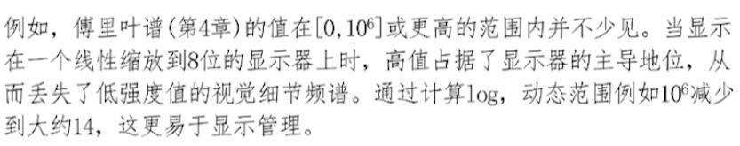

# 数字图像处理

## 空域处理

* 图像增强方法两大类：**空域方法**和**频域方法**。
> 空域方法是基于图像中的像素直接进行局部处理；
> 频域方法是基于图像的傅里叶变换进行处理

### 1. 灰度变换（亮度变换）
空间域处理的数学表示：
$$
    g(x,y) = T[f(x,y)]
$$
> $f(x,y)$：输入图像
> $g(x,y)$：输出图像
> $T$：在输入图像上的操作。

当输出图像$g(x,y)$仅依赖于输入图像$f(x,y)$的值时，则可表示为$s = T(r)，$称为灰度变换。

上图中间图片的处理为对比拉伸变换，右图的处理为二值化处理。

#### （1）幂律变换

数学公式：$s = cr^{\gamma}$，

${\gamma} > 1$时，图像高灰度区域对比度增强，${\gamma} < 1$时，图像低灰度区域对比度增强。

#### （2）对数变换

数学公式：$s = c{\rm log}(1 + r)$，主要用途之一是压缩动态范围

#### （3）对比度拉伸变换
数学公式：$s = \frac{1}{1+(m/r)^E}$ 

> $m$用于控制曲线的压缩范围。
> $E$用于控制曲线的斜率。

